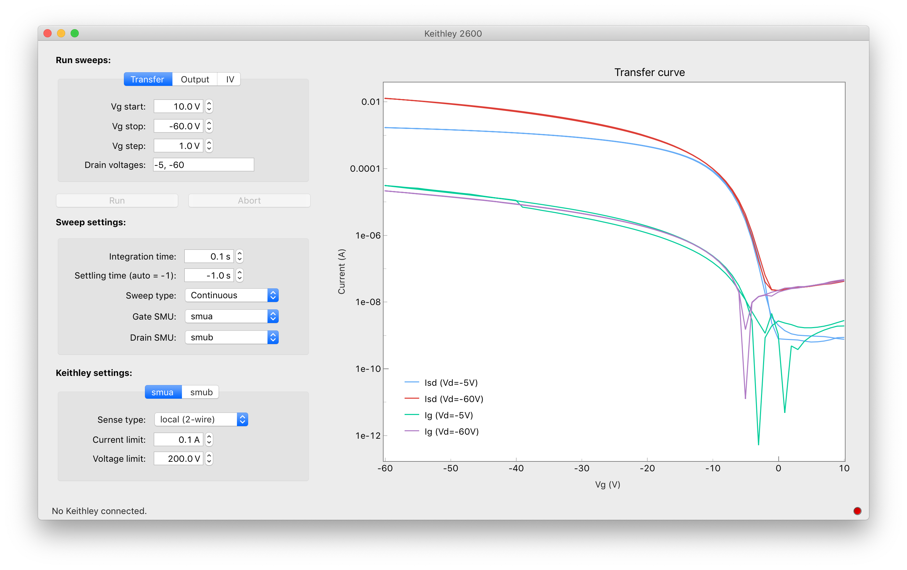

[](https://pypi.org/project/keithleygui/)
[](https://pepy.tech/project/keithleygui)
[](https://travis-ci.com/OE-FET/keithleygui)

**Warning:** Keithleygui v1.1.4 is the last release that is developed and tested
for Python 2.7. Newer releases require Python 3.6 or higher.

# keithleygui
A high-level user interface for Keithley 2600 series instruments which allows
the user to configure, record and save voltage sweeps such as transfer and
output measurements. Since there typically is no need to provide a live stream
of readings from the Keithley, the data from an IV-curve is buffered locally on
the instrument and only transferred to CustomXepr after completion of a
measurement.

`keithleygui` build on the Python driver provided by
[keithley2600](https://github.com/OE-FET/keithley2600).



## Installation
Install the stable version from PyPI by running
```console
$ pip install keithleygui
```
Or install the latest development version from GitHub:
```console
$ pip install git+https://github.com/OE-FET/keithleygui
```

## Usage
In the terminal, run `keithleygui` to start the user interface. If your provide the
`--verbose` option, log output showing the communication with the Keithley will be
printed to the console.

To start the user interface in a running Python terminal:

```Python
from PyQt5 import QtWidgets
from keithleygui import KeithleyGuiApp

app = QtWidgets.QApplication([])

keithley_gui = KeithleyGuiApp()
keithley_gui.show()
app.exec()
```

You can optionally provide an existing `Keithley2600` instance to be used by the GUI:

```Python
from PyQt5 import QtWidgets
from keithley2600 import Keithley2600
from keithleygui import KeithleyGuiApp

app = QtWidgets.QApplication([])

keithley = Keithley2600('visa_address')
keithley_gui = KeithleyGuiApp(keithley)
keithley_gui.show()
app.exec()
```


## System requirements

- Linux or macOS
- Python 3.6 or higher

## Acknowledgements
- Config modules are based on the implementation from [Spyder](https://github.com/spyder-ide).
- Scientific spin boxes are taken from [qudi](https://github.com/Ulm-IQO/qudi).
